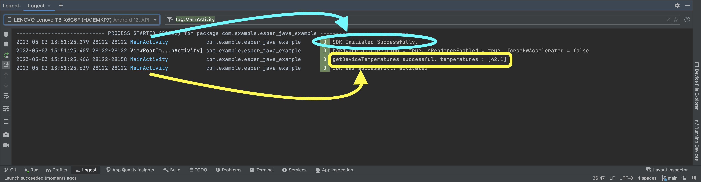

# esper-java-example

### This repository contains a minimalist example of how to use the Esper Java SDK. The code provided can be used as a starting point for developing your own applications that leverage Esper's device SDK.

---
## \*\*Please Read Before Starting \*\*

This example assumes that you have already provisioned a device in your [esper](https://esper.io) tenant. If you have no idea what I'm talking about or are in seek of that information you can get started [here](https://help.esper.io/hc/en-us/sections/12589680290321-Getting-Started).

After provisioning a device, you will also need to [generate an api key](https://help.esper.io/hc/en-us/articles/12656963209361-Generate-an-API-Key).

After completing these steps you can then proceed with this example. 

---
### Clone the Repository

To get started, clone this repository to your local machine using the following command:

```bash
git clone https://github.com/ethinallen/java-sdk-example.git
```

---
### Configure Your API Key

Before you can run the example code, you will need to populate your API key in the MainActivity.java file. This file is located in the app/src/main/java/com/example/esper_java_example directory.

To populate your API key, follow these steps:
1. Open the MainActivity.java file in a text editor or IDE.
2. Locate line 32, which should look like this:

```java
// Add api token from API Key Management in your esper tenant
String token = "<YOUR_API_KEY_HERE>";
```

3. Replace `<YOUR_API_KEY_HERE> with your actual API key.
4. Save the file.

---
#### Run the Example

Once you have completed these steps, you are ready to run the example code.


To run the example code, simply build the project using your preferred build tool, such as Gradle or Maven, and then run the resulting executable. The code provided in this repository is the basic activity template in Android Studio. The only additions are the necessary imports as defined [in our device sdk documentation](https://help.esper.io/hc/en-us/articles/12313544352913-Esper-Device-SDK). 

The code provided in this repository is the android studio `basic activity` template with our device sdk initialization and `getTemperature()` methods added.

To verify that the SDK is working correctly, look for logcat output with the tag "MainActivity". You should see messages indicating that the SDK initialized successfully and that it is able to retrieve the device temperature. 


> example logcat output; make sure to filter by `tag:MainActivity`

If you do not see these messages, check that you have properly populated your API key and that you are connected to a device that has been provisioned in your Esper tenant.

---
### Support

If you encounter any issues or have questions about using the Esper Java SDK, please reach out to our support team at support@esper.io. We are happy to help you get started and answer any questions you may have.